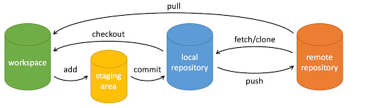

[TOC]

## 一、Git 创建仓库

Git 创建仓库分为两种，一种是在本地目录中运行`git init`，另一种是对现有的 **Git 仓库进行克隆**，命令是` git clone`；

当创建好仓库后则需要对仓库进行相关的配置，配置常用的命令为 `git config`，其中配置分为**全局配置和局部配置**；

> 全局配置：对于系统上的所有仓库进行配置，`git config -e --global`
>
> 局部配置：对于当前仓库做配置 `git config -e`

## 二、Git 基本操作

Git 常用命令包括：`git clone\git push\git add\git commit\git checkout\git pull`，他们之间的关系如下：

* 创建仓库命令

  `git init`

  `git clone <url> <rename>`

* 提交与修改

  `git add`：提交到暂存区

  `git status -<options>`：查看当前的状态

  `git diff`：查看文件之间的差别

  `git commit <filename> -m <message>`：提交到本地仓库，可以通过 `git commit -a ` 来直接提交

  `git reset [--soft | -- mixed | --hard][HEAD]`：用于回退版本，可以指定退回某一次提交的版本。

  > HEAD表示当前版本
  >
  > HEAD^ 上一个版本
  >
  > HEAD^^ 上上一个版本

  `git rm <file>`：删除文件

  > `git rm -f <file>`：强制删除工作区和暂存区的文件
  >
  > `git rm --cached <file>`：删除暂存区中的文件
  >
  > `git rm -r *`：递归删除整个目录和子目录

  `git mv`：移动文件并且重名

  > `git mv -f <file>`：如果存在重名强制移动

* 提交日志

  `git log`：查看历史提交记录

  > `git log --oneline`：查看历史记录的简介版本
  >
  > `git log --graph`：查看拓扑图
  >
  > `git log --author=<name>`：查看某人的相关提交部分

  `git blame`：查看某个文件的制定修改记录

  

